# Visualizações do Projeto - Teste do Pezinho

Este documento descreve os principais gráficos gerados nas análises do projeto "Teste do Pezinho", organizados por notebook.

---

## 1. Análise de Cancelamentos ([`Analise1.ipynb`](file:///home/bruno/VscodeProjetos/Teste_do_pezinho/Analise1.ipynb))

Este notebook foca em entender por que as amostras são canceladas e onde isso ocorre com mais frequência.

*   **Top 15 Municípios com Mais Cancelamentos**:
    *   **Tipo**: Gráfico de barras horizontais.
    *   **Representação**: Mostra quais municípios maranhenses possuem o maior volume absoluto de cancelamentos de exames. É crucial para identificar regiões que precisam de treinamento ou melhoria logística.
    
    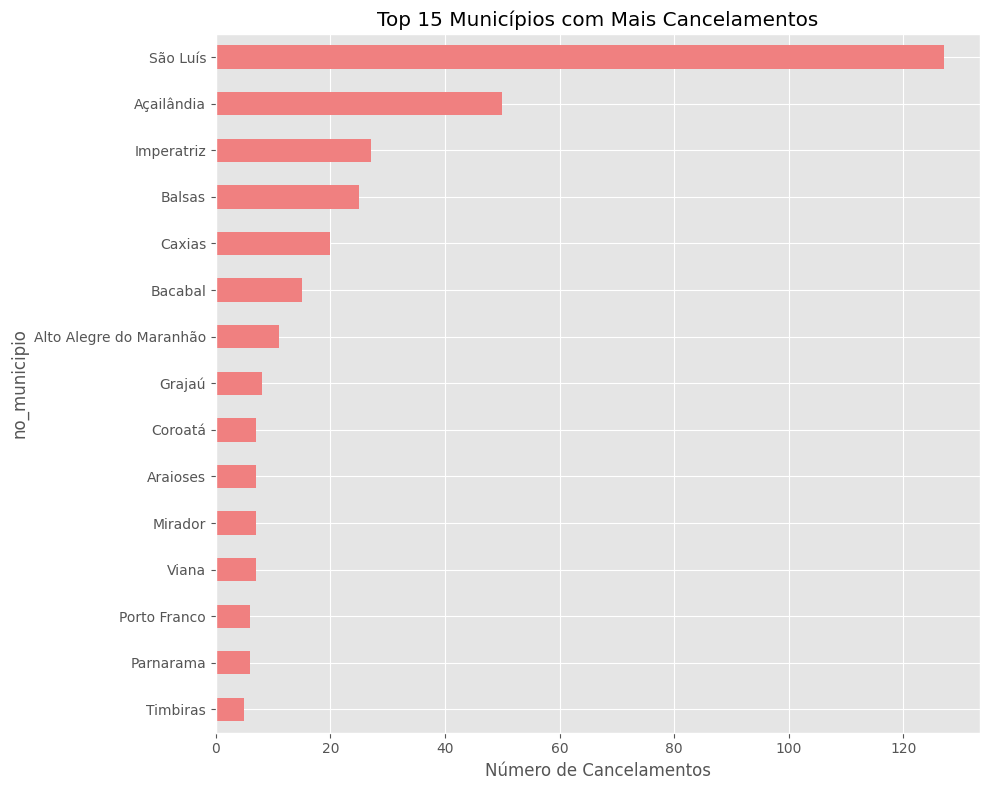

*   **Top 15 Unidades de Saúde com Mais Cancelamentos**:
    *   **Tipo**: Gráfico de barras horizontais.
    *   **Representação**: Detalha as unidades de saúde (hospitais, UBS, APAEs) que lideram o ranking de cancelamentos, permitindo intervenções diretas nas instituições.
    
    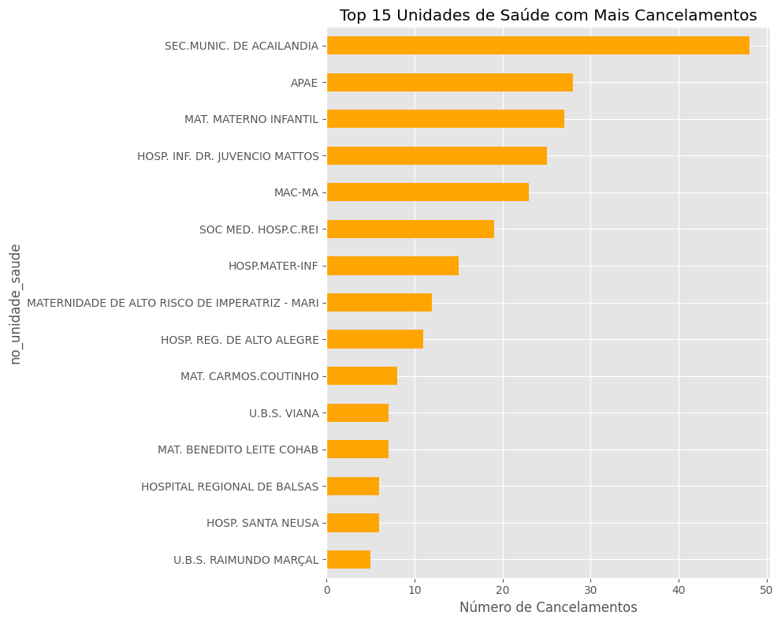

*   **Top 10 Profissões com Maior Taxa de Cancelamento**:
    *   **Tipo**: Gráfico de barras verticais.
    *   **Representação**: Analisa o percentual de erro/cancelamento por categoria profissional. Ajuda a entender se certas profissões enfrentam mais dificuldades técnicas na coleta.
    
    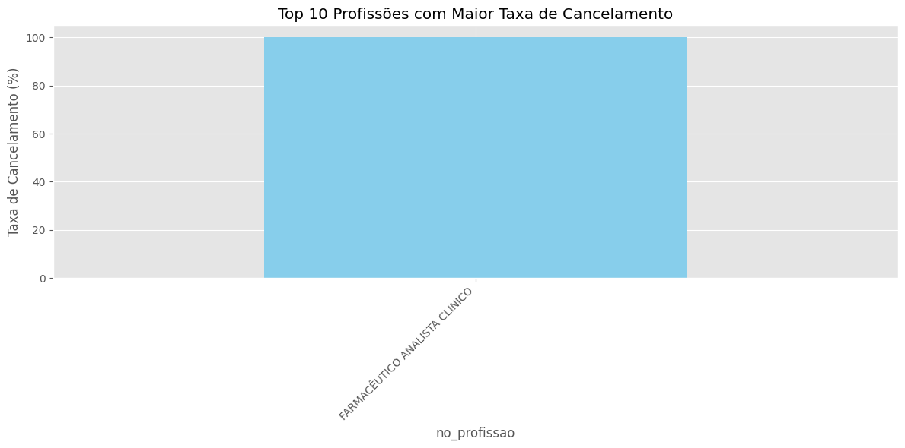

---

## 2. Eficiência Temporal e TAT ([`Analise2.ipynb`](file:///home/bruno/VscodeProjetos/Teste_do_pezinho/Analise2.ipynb))

Analisa o tempo decorrido entre o nascimento e a coleta (Turnaround Time 1).

*   **Distribuição da Idade na Coleta (Dias) & Classificação de Eficiência**:
    *   **Tipo**: Subplots combinados (Histograma com KDE à esquerda; Gráfico de contagem à direita).
    *   **Representação**: O primeiro gráfico mostra com quantos dias de vida a maioria dos bebês está realizando o teste (ideal de 3 a 5 dias). O segundo categoriza as coletas em 'Precoce', 'Ideal', 'Tardio' e 'Muito Tardio'.
    
    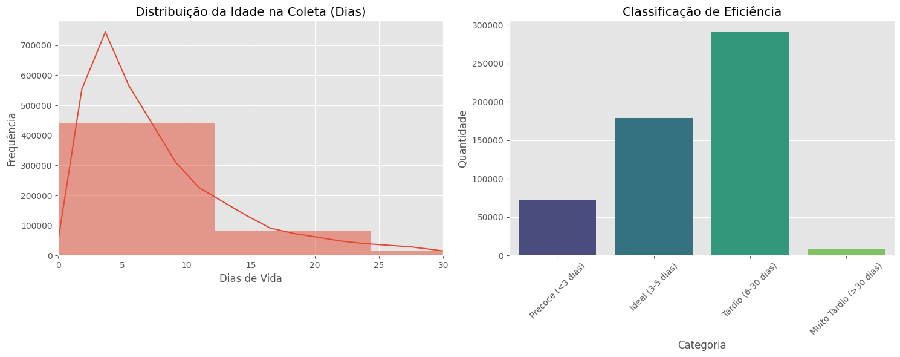

*   **Evolução Mensal de Amostras Canceladas**:
    *   **Tipo**: Gráfico de barras temporais.
    *   **Representação**: Mostra a tendência de cancelamentos ao longo do tempo (meses/anos), identificando se o problema está crescendo ou diminuindo.
    
    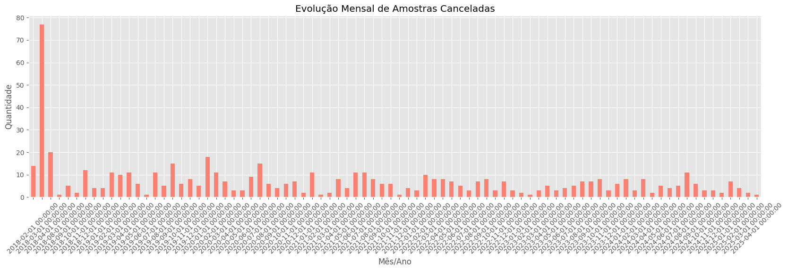

*   **Volume de Coletas vs. Recebimentos por Dia da Semana**:
    *   **Tipo**: Subplots combinados (Gráficos de barras comparativos).
    *   **Representação**: Identifica em quais dias há mais coletas nas pontas e em quais dias o laboratório recebe mais carga. Ajuda a detectar gargalos de final de semana.
    
    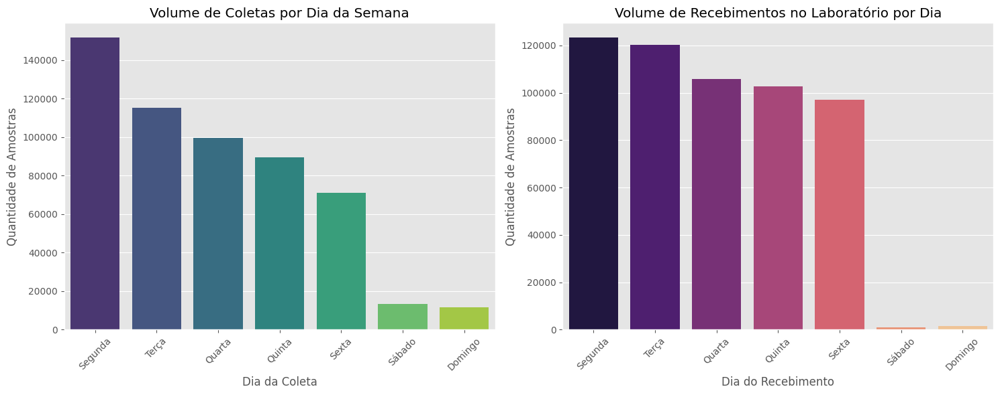

*   **Tempo de Transporte Mediano por Dia da Coleta**:
    *   **Tipo**: Gráfico de barras.
    *   **Representação**: Mostra se coletas feitas em dias específicos (ex: sexta-feira) demoram mais para chegar ao laboratório devido à indisponibilidade de transporte nos fins de semana.
    
    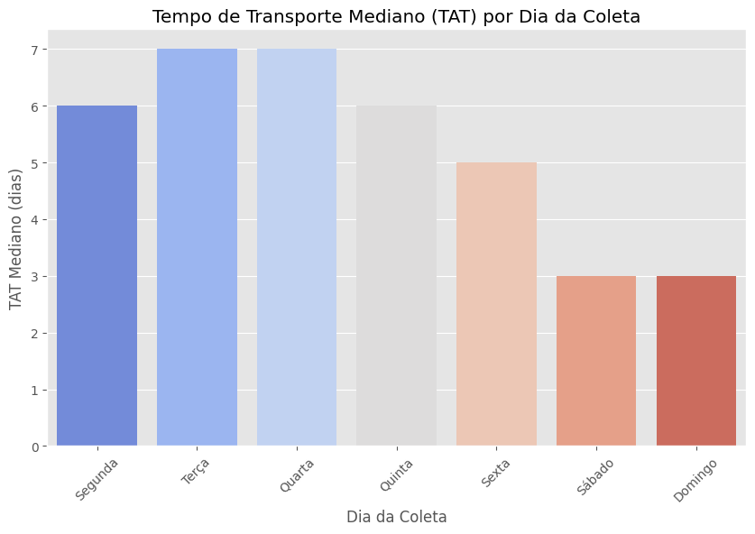

---

## 3. Logística e Qualidade ([`Analise3.ipynb`](file:///home/bruno/VscodeProjetos/Teste_do_pezinho/Analise3.ipynb))

Foca no tempo de transporte da unidade até o laboratório central.

*   **Distribuição do Tempo de Transporte**:
    *   **Tipo**: Histograma.
    *   **Representação**: Mostra o tempo (em dias) que as amostras levam para viajar do interior até o centro de análise.
    
    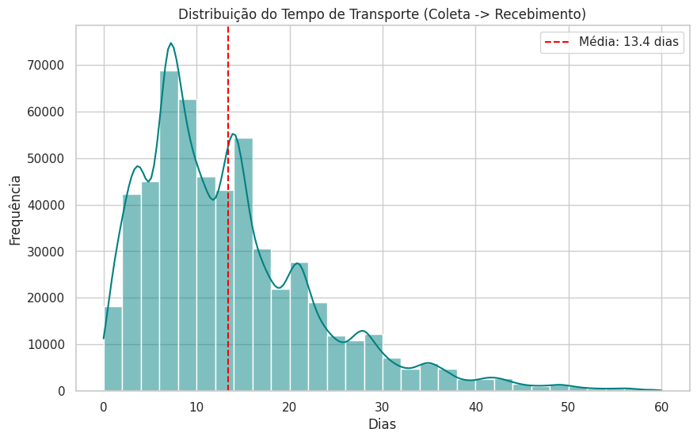

*   **Taxa de Cancelamento por Tempo de Transporte**:
    *   **Tipo**: Gráfico de barras.
    *   **Representação**: Uma análise crítica que mostra se quanto mais tempo uma amostra demora no transporte, maior é a chance de ela ser rejeitada por inadequação (ex: sangue hemolisado).
    
    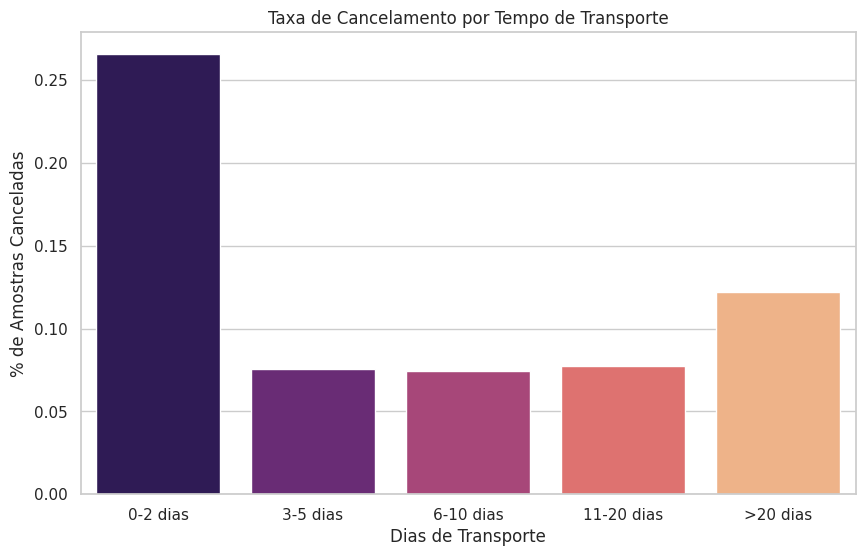

*   **Top 15 Municípios com Maior Tempo Médio de Transporte**:
    *   **Tipo**: Gráfico de barras.
    *   **Representação**: Identifica as cidades com a logística mais lenta de transporte.
    
    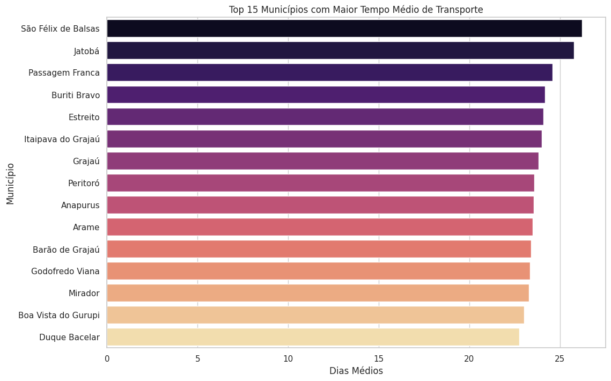

*   **Performance por Município: Transporte vs Rejeição**:
    *   **Tipo**: Gráfico de dispersão (Scatter Plot).
    *   **Representação**: Cruza a demora no transporte com a taxa de rejeição. Cidades no canto superior direito são os pontos críticos de logística e qualidade.
    
    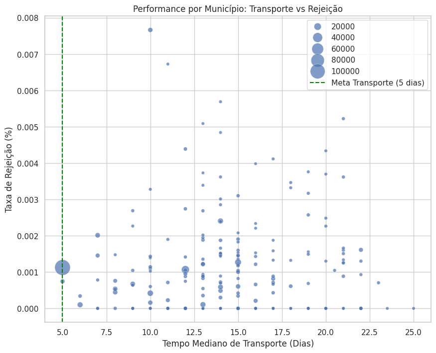

*   **Sazonalidade do Tempo de Transporte**:
    *   **Tipo**: Gráfico de linha.
    *   **Representação**: Analisa se o transporte piora em certas épocas do ano (ex: período de chuvas no Maranhão).
    
    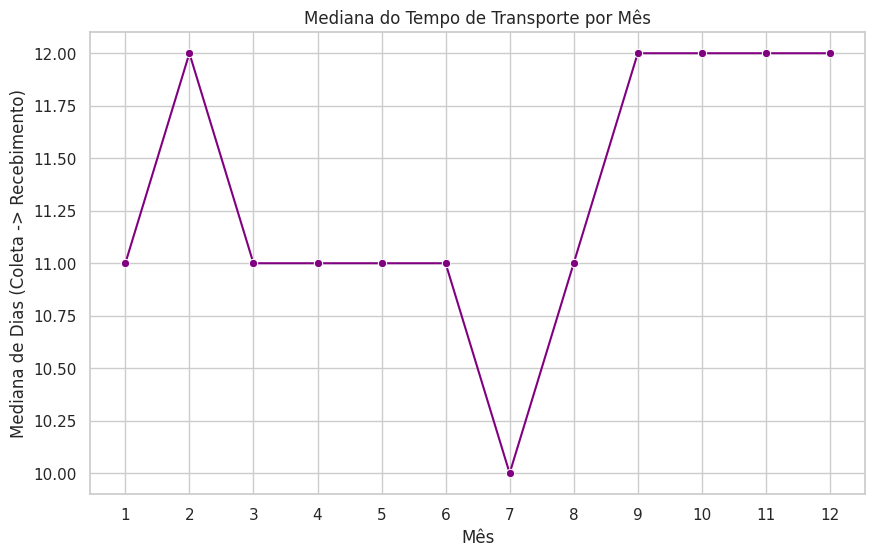

---

## 4. Machine Learning Preditivo ([`Analise4_ML_Preditivo.ipynb`](file:///home/bruno/VscodeProjetos/Teste_do_pezinho/Analise4_ML_Preditivo.ipynb))

Visualizações sobre a performance dos modelos de inteligência artificial.

*   **Curvas ROC e Precision-Recall (Regressão Logística)**:
    *   **Tipo**: Gráficos de linha (Performance Curves).
    *   **Representação**: Avaliam a capacidade da Regressão Logística de distinguir entre recém-nascidos saudáveis e aqueles com tendência a doenças.
    
    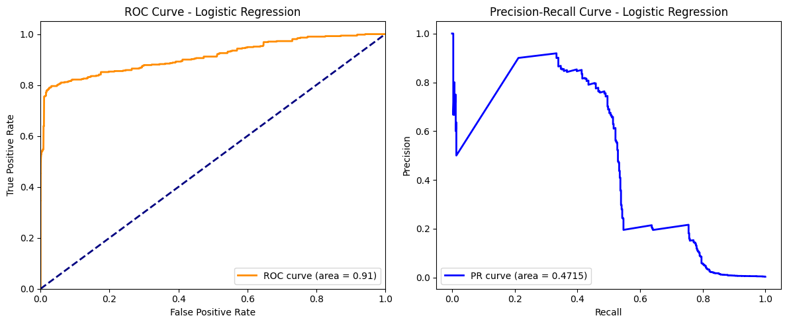

*   **Curvas ROC e Precision-Recall (HistGradientBoosting)**:
    *   **Tipo**: Gráficos de linha (Performance Curves).
    *   **Representação**: Avaliam a capacidade do HistGradientBoosting de distinguir entre classes sob desbalanceamento extremo.
    
    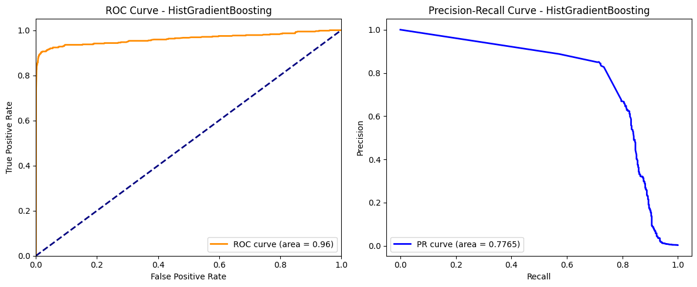

*   **Importância das Variáveis (Feature Importance - Permutation)**:
    *   **Tipo**: Gráfico de barras.
    *   **Representação**: Revela quais fatores (como peso ao nascer ou idade de coleta) são mais determinantes para o modelo prever o risco de doença.
    
    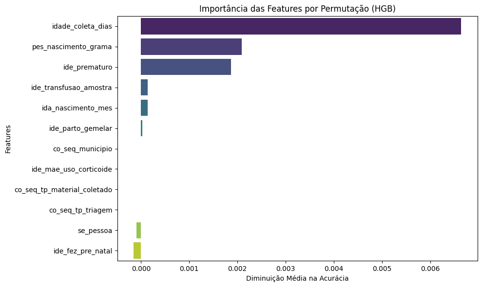
