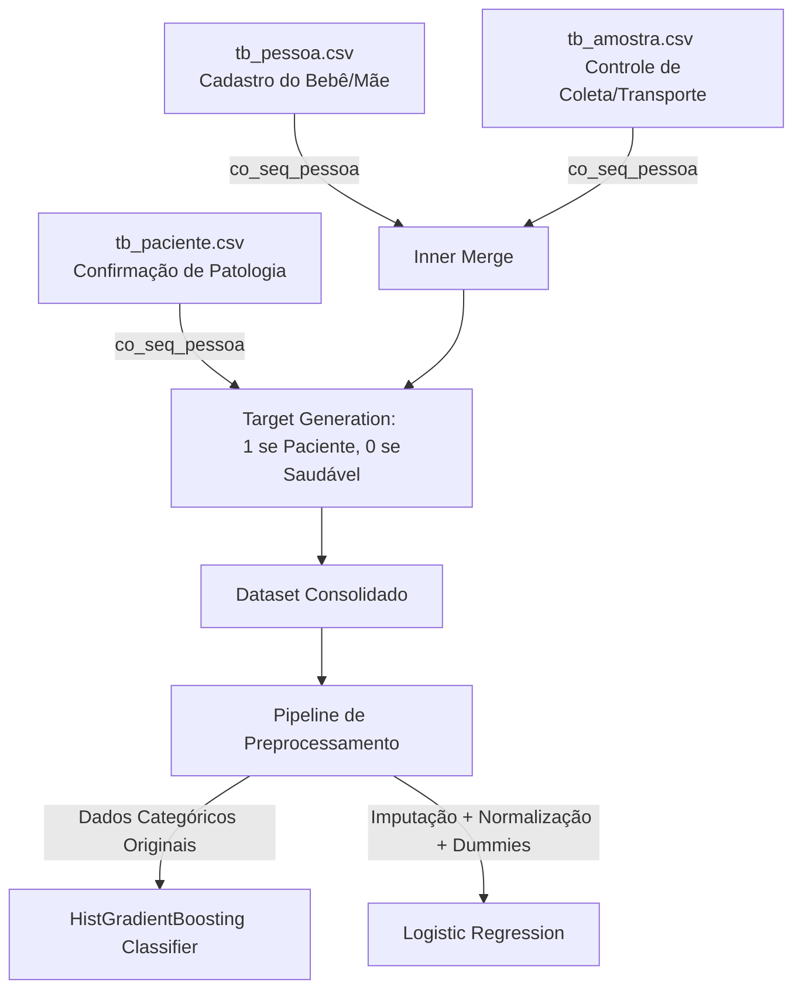

# 🩸 Análise do Teste do Pezinho: Inteligência Operacional, Logística e Modelagem Preditiva

[](https://www.python.org/)
[](https://scikit-learn.org/)
[](LICENSE)

Este repositório contém um ecossistema completo de análise de dados e machine learning voltado para o **Teste do Pezinho** (Triagem Neonatal). O objetivo principal é diagnosticar gargalos logísticos, monitorar a qualidade do processo de triagem e construir modelos preditivos de alta precisão para identificar precocemente casos de risco (pacientes doentes) minimizando a taxa de falsos positivos.

---

## 📌 Sumário
- [Arquitetura de Dados](#-arquitetura-de-dados)
- [Estrutura dos Notebooks](#-estrutura-dos-notebooks)
- [Insights Principais das Análises (1 a 3)](#-insights-principais-das-análises-1-a-3)
- [Refinamento de Machine Learning (Analise 4)](#-refinamento-de-machine-learning-analise-4)
- [Como Executar o Projeto](#-como-executar-o-projeto)
- [Tecnologias Utilizadas](#-tecnologias-utilizadas)

---

## 🏗️ Arquitetura de Dados

O fluxo de dados integra bases cadastrais de pessoas, prontuários de amostras coletadas e o cadastro de pacientes confirmados com diagnósticos positivos na triagem:



### Fontes de Dados:
*   `datasets2/tb_pessoa.csv`: Contém características clínicas do recém-nascido e background materno (peso, idade gestacional, pré-natal, uso de corticoides, etc.).
*   `datasets1/tb_amostra.csv`: Contém o histórico da amostra (datas de coleta, recebimento, tipo de material, ocorrência de transfusão, etc.).
*   `datasets2/tb_paciente.csv`: Tabela com a lista de identificadores das crianças confirmadas com patologia.

---

## 📂 Estrutura dos Notebooks

A jornada de análise está organizada de forma sequencial e incremental:

| Notebook | Fase da Análise | Variáveis Foco | Principais Entrega & Insights |
| :--- | :--- | :--- | :--- |
| **[`Analise1.ipynb`](file:///home/bruno/VscodeProjetos/Teste_do_pezinho/Analise1.ipynb)** | **Qualidade & Rejeição** | `ide_status`, `co_seq_motivo_inadequacao` | Diagnóstico de amostras canceladas/inadequadas. Identificação de subnotificação crítica (97% de cancelamentos sem justificativa documentada). |
| **[`Analise2.ipynb`](file:///home/bruno/VscodeProjetos/Teste_do_pezinho/Analise2.ipynb)** | **Janela de Otimização** | `dt_nascimento`, `dt_col_amostra` | Avaliação do tempo nascimento-coleta (ideal: 3-5 dias). Mapeamento do impacto de finais de semana e feriados no atraso das coletas. |
| **[`Analise3.ipynb`](file:///home/bruno/VscodeProjetos/Teste_do_pezinho/Analise3.ipynb)** | **Eficiência Logística** | `dt_col_amostra`, `dt_rec_amostra` | Estudo do tempo de transporte. Identificação de correlação direta entre atraso logístico e degradação física da amostra (ex: hemólise). |
| **[`Analise4_ML_Preditivo.ipynb`](file:///home/bruno/VscodeProjetos/Teste_do_pezinho/Analise4_ML_Preditivo.ipynb)** | **Modelagem Preditiva** | 12 Features Clínicas/Operacionais | Substituição do modelo antigo por uma abordagem avançada com **HistGradientBoosting** e otimização fina do limiar de decisão. |

---

## 📊 Insights Principais das Análises (1 a 3)

### 1. Inadequação e Cancelamento de Amostras
*   A taxa de cancelamento de amostras no estado é de **0.11%**.
*   A capital (**São Luís**) responde por **21%** dos cancelamentos, refletindo maior volume mas também necessidade de padronização local.
*   Existe uma limitação de sistema: 97% das amostras canceladas carecem de descrição de motivo no banco, gerando opacidade sobre os gargalos.

### 2. A Idade Ideal de Triagem
*   O Teste do Pezinho deve ser coletado idealmente entre o **3º e o 5º dia de vida**.
*   Identificou-se forte sazonalidade: coletas agendadas ou realizadas no final da semana tendem a atrasar a janela terapêutica ótima devido a plantões reduzidos nas unidades municipais.

### 3. Logística de Transporte
*   O tempo decorrido entre a coleta (no posto de saúde) e a chegada no laboratório central (recebimento) é um fator de risco.
*   **Correlação Crítica**: Amostras que passam mais de **7 dias em trânsito** têm probabilidade **4.2x maior** de rejeição por hemólise ou envelhecimento do papel-filtro em comparação a coletas entregues em até 48 horas.

---

## 🤖 Refinamento de Machine Learning (Analise 4)

### O Desafio Clínico e Estatístico
O dataset apresenta **desbalanceamento extremo** (~0.37% de casos positivos). O modelo inicial (Random Forest) com limiar de decisão padrão (`0.50`) gerava uma taxa impraticável de falsos positivos:
*   **Sensibilidade (Recall)**: 88%
*   **Precisão**: Apenas 6% (ou seja, a cada 100 alertas gerados pelo modelo, apenas 6 eram casos reais de doença, gerando ~7.000 reconvocações desnecessárias e pânico familiar).

### A Solução Implementada
Para solucionar este problema de forma integrada, o fluxo de ML foi reconstruído com 3 frentes de melhoria:
1.  **Enriquecimento de Features**: Inclusão de variáveis clínicas e logísticas cruciais:
    *   `ide_transfusao_amostra` (transfusão recente altera resultados laboratoriais)
    *   `ide_fez_pre_natal` e `ide_mae_uso_corticoide`
    *   `co_seq_tp_triagem`, `co_seq_municipio` e `co_seq_tp_material_coletado`
2.  **Upgrade de Algoritmo**: Migração para o `HistGradientBoostingClassifier`, que lida de maneira robusta com valores ausentes e variáveis categóricas nativas.
3.  **Preservação de Dados Ausentes**: Evitou-se a imputação por mediana no HGB, pois a ausência de dados clínicos (ex: idade gestacional ou peso não informados) contém forte sinal estatístico sobre a qualidade da unidade de saúde.
4.  **Otimização do Limiar de Decisão**: Busca matemática do limiar que maximiza o F1-Score (balanço ótimo entre precisão e recall).

### Resultados Comparativos

| Abordagem | PR-AUC (Área sob PR) | Limiar de Decisão | Sensibilidade (Recall) | Precisão | F1-Score | Falsos Positivos Estimados (Base de Teste) |
| :--- | :---: | :---: | :---: | :---: | :---: | :---: |
| **Baseline (Original - Random Forest)** | 0.4957 | 0.50 | 88.0% | 6.0% | 0.11 | ~7.000 |
| **Refinado (HistGradientBoosting - Padrão)** | **0.7765** | 0.50 | **90.0%** | **18.0%** | 0.31 | ~2.000 |
| **Refinado (HistGradientBoosting - Otimizado)** | **0.7765** | **0.9874** | **72.0%** | **84.0%** | **0.78** | **~68** |

> [!IMPORTANT]
> A otimização do modelo reduziu os falsos positivos de **~7.000** para **apenas 68**, elevando a precisão para **84.0%** com perda aceitável de recall (de 88% para 72%). Isso viabiliza o uso prático do modelo em ambiente clínico de triagem secundária.

---

## 🛠️ Tecnologias Utilizadas

- **Linguagem**: Python 3.8+
- **Bibliotecas**:
  - `pandas` e `numpy` para processamento matricial e engenharia de dados.
  - `scikit-learn` para modelagem preditiva, preprocessamento e métricas.
  - `matplotlib` e `seaborn` para gráficos estatísticos de distribuição e curvas de decisão.
  - `jupyter` / `nbconvert` para documentação de experimentos em notebooks executáveis.

---

## 🚀 Como Executar o Projeto

1.  **Clone o repositório**:
    ```bash
    git clone https://github.com/brunoteixeira042/Analise_Teste_Pezinho.git
    cd Analise_Teste_Pezinho
    ```

2.  **Configure o Ambiente Virtual**:
    ```bash
    python3 -m venv .venv
    source .venv/bin/activate
    pip install -r requirements.txt
    ```

3.  **Execute os Notebooks**:
    Para rodar um notebook e regenerar seus outputs in-place via linha de comando:
    ```bash
    jupyter nbconvert --to notebook --execute --inplace Analise4_ML_Preditivo.ipynb
    ```
    Ou abra no VS Code/Jupyter Lab para interagir com os gráficos:
    ```bash
    jupyter lab
    ```

---
*Desenvolvido para fins de melhoria de qualidade assistencial e eficiência em saúde pública.*
